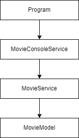

# MoviesMenu Console App

## Overview
As part of my bootcamp at Bitlab Digital, where I am training to become a backend developer, I have developed the MoviesMenu console app. This app performs CRUD (Create, Read, Update, Delete) operations for managing a list of movies.

## Technologies Used
- **C#**
- **.NET**
- **MS SQL Server**

## Project Structure

### Exercise 1: Using `List<T>`
In the first exercise, the app stores movie data in a `List<Movie>`. This approach is suitable for learning the basics of CRUD operations and understanding how to manage collections in memory.

#### Features
- **Add Movie**: Adds a new movie to the list.
- **View Movies**: Displays all movies in the list.
- **Update Movie**: Updates the details of an existing movie.
- **Delete Movie**: Removes a movie from the list.

#### Architecture

